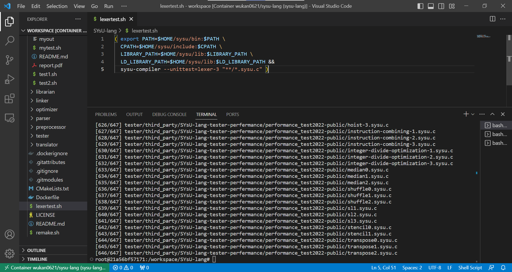
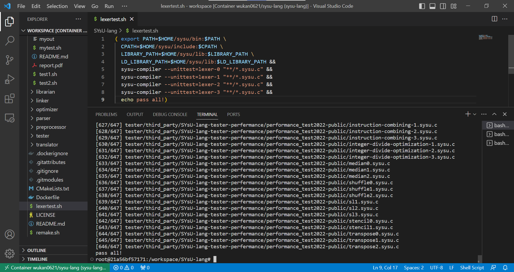
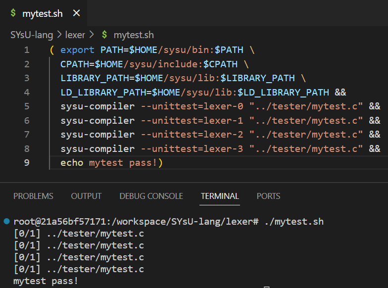

# report

| 学号     | 姓名   |
| -------- | ------ |
| 20337091 | 马佳欣 |

## 实验过程

1. 在`lexer/lexer.l`模板的基础上完成更多的`token`：

   注：实验模板欠缺一下`token`：

   ```
   token		name
   
   float		float
   ...			ellipsis
   ```

2. 在`lexer/lexer.l`中增加`genflag()`函数，处理无关字符` [StartOfLine] [LeadingSpace]`：

   思路：增加全局变量`yynewline`、`yynewspace`用于标记新行、新空格，分情况设置`flag`：

   ```C
     if(yynewline && yynewspace){
       flag = " [StartOfLine] [LeadingSpace]";
     }
     else if(yynewline){
       flag = " [StartOfLine]";
     }
     else if(yynewspace){
       flag = " [LeadingSpace]";
     }
     else{
       flag = "";
     }
   ```

3. 挑战方向：扩展更多 C 语言的 `token`

   - 踩过的坑：
     - 不支持数据类型`bool`，`Clang`将其识别为`identifier`；
     - 不需要写`long long`类型对应的规则，`Clang`将其识别为两个`long`。

   - 更多`token`：

     ```
     token		name
     
     :			colon
     auto		auto
     double		double
     long		long
     enum		enum
     register	register
     short		short
     signed		signed
     unsigned	unsigned
     static		static
     struct		struct
     union		union
     typedef		typedef
     do			do
     switch		switch
     case		case
     default		default
     for			for
     goto		goto
     sizeof		sizeof
     extern		extern
     ++			plusplus
     +=			plusequal
     --			minusminus
     -=			minusequal
     *=			starequal
     /=			slashequal
     %=			percentequal
     ```

4. 根据新扩展的`token`，编写新的测例`tester/mytest.c`和评测脚本`lexer/mytest.sh`。

## 难点

### 设计字符串的正则表达式

1. 初始版本`\"[^"]\"`：
   - 思路：不允许字符串中单独出现`"`
   - 缺点：出现`\"`不被允许
2. 最终版本`\"([^\"\\]|\\.)*\"`
   - 思路：`|`左边规定：不允许单独出现`"`和`\`；右边规定：`\`的后面需要带任意字符（`\n`除外）

### 设计小数的正则表达式

总共有三种表示：

1. 十进制小数点计数法
2. e-计数法
3. p-计数法

## 自动评测结果

### 0


### 1


### 2


### 3



### 汇总



### 新的测例评测结果

